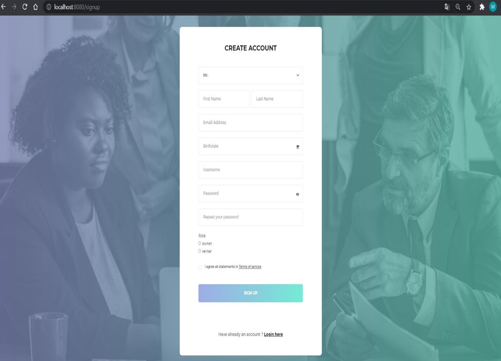
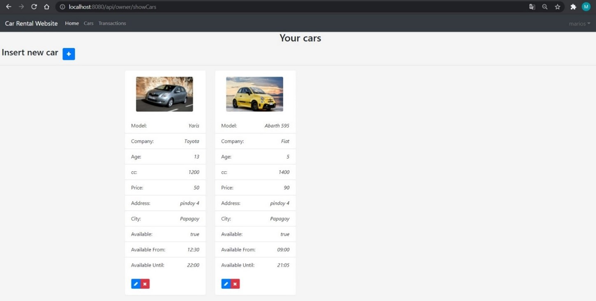

# CarRental
Demo car rental web application

## Description
The purpose of the project is the creation of an online car rental website. Its users will be either the owners of vehicles for rent or potential interested renters. 
In order to browse the website the user has to create an account in which will have a status (renter or owner)
and depending on his choice he will be able to perform different actions. 
Car owners, can create posts of their available vehicle for rent, including a photo of the vehicle and a description of it, such as the model, age, rental cost, location, availability, etc. 
Renters can browse the available rental cars and choose the desired one based on their preferences.
After a rental is complete, both the car owner and the renter can comment and rate their satisfaction. 

## Frameworks used
- Java Spring boot Framework
- Spring Security Framework

## Screenshots
<figure>
  
  <figcaption>Fig.1 - Homepage.</figcaption>
</figure>
  
<figure>
  
  <figcaption>Fig.2 - Register form.</figcaption>
</figure>
  
<figure>
  
  <figcaption>Fig.3 - Login form.</figcaption>
</figure>
  
<figure>
  
  <figcaption>Fig.4 - Owner's main page.</figcaption>
</figure>
  
<figure>
  
  <figcaption>Fig.5 - Owner's Profile.</figcaption>
</figure>
  
<figure>
  
  <figcaption>Fig.6 - Owner's car management page.</figcaption>
</figure>
  
<figure>
  
  <figcaption>Fig.7 - Owner's trasnactions table.</figcaption>
</figure>
  
<figure>
  
  <figcaption>Fig.8 - Renter's main page.</figcaption>
</figure>
  
<figure>
  
  <figcaption>Fig.9 - Available cars for rent page.</figcaption>
</figure>
  
<figure>
  
  <figcaption>Fig.10.1 - Details of the selected car.</figcaption>
</figure>
  
<figure>
  
  <figcaption>Fig.10.2 - Details of the selected car and the rental form.</figcaption>
</figure>
  
<figure>
  
  <figcaption>Fig.11 - Table of the rented cars.</figcaption>
</figure>
  
<figure>
  
  <figcaption>Fig.12 - Review and rating form.</figcaption>
</figure>

